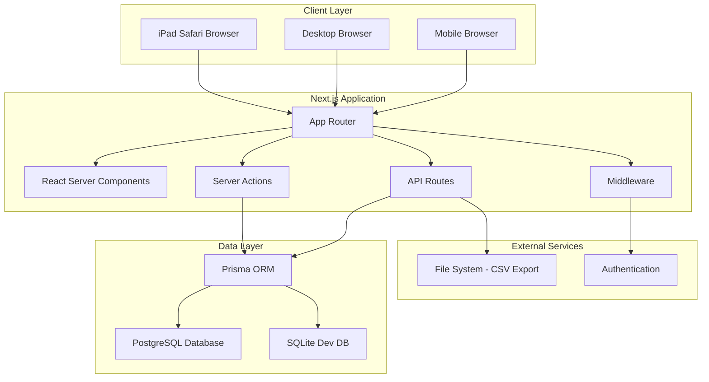
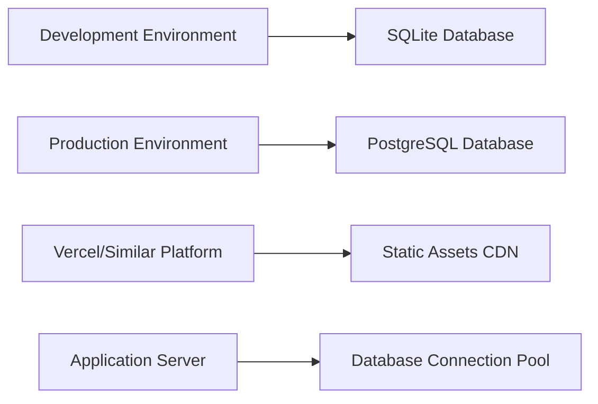
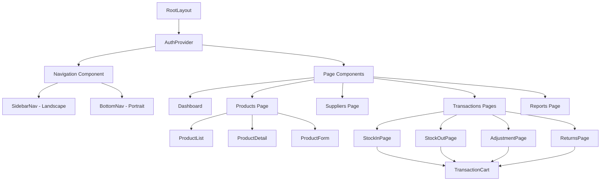
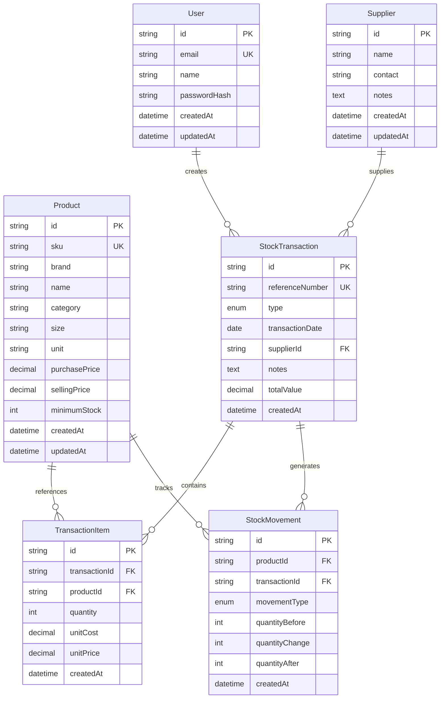

# Design Document

## Overview

CatStock is a Next.js-based inventory management application designed with a tablet-first approach, specifically optimized for iPad Pro 11-inch devices. The system follows a modern full-stack architecture using React Server Components, Server Actions, and a PostgreSQL database with Prisma ORM. The design emphasizes touch-friendly interfaces, efficient data handling, and robust security measures.

The application uses a master-detail pattern for core functionality, adaptive navigation based on device orientation, and streaming data patterns for optimal performance. Security is implemented through multiple layers including authentication middleware, input validation, and secure session management.

## Architecture

### High-Level Architecture



### Technology Stack

- **Frontend**: Next.js 14+ (App Router), React 18+, JavaScript (no TypeScript)
- **Styling**: Tailwind CSS with custom iPad-optimized components
- **Database**: PostgreSQL (production), SQLite (development)
- **ORM**: Prisma with optimized queries and indexing
- **Authentication**: Custom implementation with httpOnly cookies
- **Validation**: Zod for server-side input validation
- **Security**: Built-in Next.js security features + custom middleware

### Deployment Architecture



## Components and Interfaces

### Core Component Hierarchy



### Key Interface Definitions

#### Authentication Interface
```javascript
// User session structure
const UserSession = {
  id: string,
  email: string,
  name: string,
  createdAt: Date,
  isAuthenticated: boolean
}

// Authentication actions
const AuthActions = {
  login: (credentials) => Promise<UserSession | Error>,
  logout: () => Promise<void>,
  validateSession: () => Promise<UserSession | null>
}
```

#### Product Management Interface
```javascript
// Product data structure
const Product = {
  id: string,
  sku: string, // unique identifier
  brand: string,
  name: string,
  category: string,
  size: string,
  unit: string,
  purchasePrice: number | null,
  sellingPrice: number | null,
  minimumStock: number | null,
  currentStock: number, // calculated field
  createdAt: Date,
  updatedAt: Date
}

// Product operations
const ProductActions = {
  createProduct: (productData) => Promise<Product>,
  updateProduct: (id, productData) => Promise<Product>,
  deleteProduct: (id) => Promise<void>,
  getProducts: (filters, pagination) => Promise<ProductList>,
  searchProducts: (query) => Promise<Product[]>
}
```

#### Stock Transaction Interface
```javascript
// Transaction structure
const StockTransaction = {
  id: string,
  referenceNumber: string,
  type: 'IN' | 'OUT' | 'ADJUST' | 'RETURN_IN' | 'RETURN_OUT',
  date: Date,
  supplierId: string | null,
  notes: string | null,
  items: TransactionItem[],
  totalValue: number | null,
  createdAt: Date
}

const TransactionItem = {
  id: string,
  productId: string,
  quantity: number,
  unitCost: number | null, // for IN transactions
  unitPrice: number | null, // for OUT transactions
  product: Product // populated relation
}

// Transaction operations
const TransactionActions = {
  createTransaction: (transactionData) => Promise<StockTransaction>,
  getTransactions: (filters, pagination) => Promise<TransactionList>,
  getProductStockCard: (productId) => Promise<StockMovement[]>
}
```

### UI Component Architecture

#### Responsive Layout Components

```javascript
// Adaptive navigation based on device orientation
const NavigationWrapper = ({ children }) => {
  const isLandscape = useMediaQuery('(orientation: landscape)')
  const isTablet = useMediaQuery('(min-width: 768px)')
  
  if (isTablet && isLandscape) {
    return <SidebarLayout>{children}</SidebarLayout>
  }
  
  return <BottomNavLayout>{children}</BottomNavLayout>
}

// Master-detail pattern for iPad
const SplitView = ({ masterContent, detailContent, masterWidth = '40%' }) => {
  return (
    <div className="flex h-full">
      <div className={`w-[${masterWidth}] border-r`}>
        {masterContent}
      </div>
      <div className="flex-1">
        {detailContent}
      </div>
    </div>
  )
}
```

#### Touch-Optimized Form Components

```javascript
// Touch-friendly input with minimum 44px height
const TouchInput = ({ label, error, ...props }) => {
  return (
    <div className="space-y-2">
      <label className="text-base font-medium">{label}</label>
      <input 
        className="w-full h-12 px-4 text-base border rounded-lg touch-manipulation"
        {...props}
      />
      {error && <p className="text-red-600 text-sm">{error}</p>}
    </div>
  )
}

// Quantity stepper for touch interaction
const QuantityStepper = ({ value, onChange, min = 0, max = 9999 }) => {
  return (
    <div className="flex items-center border rounded-lg">
      <button 
        className="w-12 h-12 flex items-center justify-center text-xl"
        onClick={() => onChange(Math.max(min, value - 1))}
      >
        -
      </button>
      <input 
        type="number"
        value={value}
        onChange={(e) => onChange(Number(e.target.value))}
        className="flex-1 h-12 text-center text-base border-x"
      />
      <button 
        className="w-12 h-12 flex items-center justify-center text-xl"
        onClick={() => onChange(Math.min(max, value + 1))}
      >
        +
      </button>
    </div>
  )
}
```

#### Transaction Cart Component

```javascript
const TransactionCart = ({ items, onUpdateItem, onRemoveItem, onSave }) => {
  return (
    <div className="w-96 h-full bg-white border-l flex flex-col">
      <div className="p-4 border-b">
        <h2 className="text-xl font-semibold">Transaction Items</h2>
      </div>
      
      <div className="flex-1 overflow-y-auto p-4 space-y-4">
        {items.map(item => (
          <TransactionCartItem 
            key={item.id}
            item={item}
            onUpdate={onUpdateItem}
            onRemove={onRemoveItem}
          />
        ))}
      </div>
      
      <div className="p-4 border-t">
        <button 
          onClick={onSave}
          className="w-full h-12 bg-blue-600 text-white text-lg font-semibold rounded-lg"
        >
          Save Transaction
        </button>
      </div>
    </div>
  )
}
```

## Data Models

### Database Schema Design



### Prisma Schema Implementation

```javascript
// prisma/schema.prisma
model User {
  id           String   @id @default(cuid())
  email        String   @unique
  name         String
  passwordHash String
  createdAt    DateTime @default(now())
  updatedAt    DateTime @updatedAt
  
  transactions StockTransaction[]
  
  @@map("users")
}

model Product {
  id            String   @id @default(cuid())
  sku           String   @unique
  brand         String
  name          String
  category      String
  size          String
  unit          String
  purchasePrice Decimal? @db.Decimal(10, 2)
  sellingPrice  Decimal? @db.Decimal(10, 2)
  minimumStock  Int?
  createdAt     DateTime @default(now())
  updatedAt     DateTime @updatedAt
  
  transactionItems TransactionItem[]
  stockMovements   StockMovement[]
  
  @@index([sku])
  @@index([brand, category])
  @@map("products")
}

model Supplier {
  id        String   @id @default(cuid())
  name      String
  contact   String?
  notes     String?
  createdAt DateTime @default(now())
  updatedAt DateTime @updatedAt
  
  transactions StockTransaction[]
  
  @@map("suppliers")
}

model StockTransaction {
  id              String            @id @default(cuid())
  referenceNumber String            @unique
  type            TransactionType
  transactionDate DateTime
  supplierId      String?
  notes           String?
  totalValue      Decimal?          @db.Decimal(12, 2)
  createdAt       DateTime          @default(now())
  
  supplier Supplier? @relation(fields: [supplierId], references: [id])
  items    TransactionItem[]
  movements StockMovement[]
  
  @@index([transactionDate])
  @@index([type])
  @@map("stock_transactions")
}

model TransactionItem {
  id            String   @id @default(cuid())
  transactionId String
  productId     String
  quantity      Int
  unitCost      Decimal? @db.Decimal(10, 2)
  unitPrice     Decimal? @db.Decimal(10, 2)
  createdAt     DateTime @default(now())
  
  transaction StockTransaction @relation(fields: [transactionId], references: [id], onDelete: Cascade)
  product     Product          @relation(fields: [productId], references: [id])
  
  @@index([transactionId])
  @@index([productId])
  @@map("transaction_items")
}

model StockMovement {
  id             String            @id @default(cuid())
  productId      String
  transactionId  String
  movementType   TransactionType
  quantityBefore Int
  quantityChange Int
  quantityAfter  Int
  createdAt      DateTime          @default(now())
  
  product     Product          @relation(fields: [productId], references: [id])
  transaction StockTransaction @relation(fields: [transactionId], references: [id])
  
  @@index([productId, createdAt])
  @@index([transactionId])
  @@map("stock_movements")
}

enum TransactionType {
  IN
  OUT
  ADJUST
  RETURN_IN
  RETURN_OUT
}
```

### Data Access Patterns

```javascript
// Optimized queries for performance
const getProductsWithStock = async (filters = {}, pagination = {}) => {
  const { page = 1, limit = 50, search, category } = pagination
  const skip = (page - 1) * limit
  
  const where = {
    ...(search && {
      OR: [
        { name: { contains: search, mode: 'insensitive' } },
        { brand: { contains: search, mode: 'insensitive' } },
        { sku: { contains: search, mode: 'insensitive' } }
      ]
    }),
    ...(category && { category })
  }
  
  return await prisma.product.findMany({
    where,
    select: {
      id: true,
      sku: true,
      brand: true,
      name: true,
      category: true,
      size: true,
      unit: true,
      purchasePrice: true,
      sellingPrice: true,
      minimumStock: true,
      _count: {
        select: {
          stockMovements: true
        }
      }
    },
    skip,
    take: limit,
    orderBy: { name: 'asc' }
  })
}

// Calculate current stock for a product
const getCurrentStock = async (productId) => {
  const movements = await prisma.stockMovement.findMany({
    where: { productId },
    orderBy: { createdAt: 'desc' },
    take: 1,
    select: { quantityAfter: true }
  })
  
  return movements[0]?.quantityAfter || 0
}
```

## Correctness Properties

*A property is a characteristic or behavior that should hold true across all valid executions of a system—essentially, a formal statement about what the system should do. Properties serve as the bridge between human-readable specifications and machine-verifiable correctness guarantees.*

Based on the prework analysis, here are the testable correctness properties for CatStock:

### Authentication and Security Properties

**Property 1: Unauthenticated access protection**
*For any* protected route in the application, when accessed without valid authentication, the system should redirect to the login page
**Validates: Requirements 1.1**

**Property 2: Valid credential session creation**
*For any* valid user credentials, when submitted for authentication, the system should create a secure session with httpOnly cookies
**Validates: Requirements 1.2**

**Property 3: Rate limiting protection**
*For any* endpoint with rate limiting enabled, when requests exceed the configured threshold, the system should reject subsequent requests until the rate limit resets
**Validates: Requirements 1.3, 1.7, 10.7**

**Property 4: Session expiration enforcement**
*For any* expired user session, when attempting to access protected resources, the system should require re-authentication
**Validates: Requirements 1.4**

**Property 5: Password hashing consistency**
*For any* password stored in the system, the stored value should be a hash generated using argon2 or bcrypt, never the plain text password
**Validates: Requirements 1.5**

**Property 6: CSRF protection coverage**
*For any* state-changing operation, when attempted without a valid CSRF token, the system should reject the request
**Validates: Requirements 1.6**

**Property 7: Authentication middleware coverage**
*For any* private page in the application, when accessed without authentication, the system should prevent access through middleware protection
**Validates: Requirements 1.8**

### Product Management Properties

**Property 8: Product creation validation**
*For any* product creation attempt, when required fields (brand, name, category, size, unit, SKU) are missing, the system should reject the creation with validation errors
**Validates: Requirements 2.1**

**Property 9: SKU uniqueness enforcement**
*For any* product creation or update attempt, when using an existing SKU, the system should prevent the operation and display an error message
**Validates: Requirements 2.2**

**Property 10: Product search comprehensiveness**
*For any* search query, when searching products, the system should return results that match the query in brand, name, category, or SKU fields
**Validates: Requirements 2.3**

**Property 11: Product list data handling**
*For any* combination of filter, sort, and pagination parameters, when applied to product lists, the system should return correctly filtered, sorted, and paginated results
**Validates: Requirements 2.5**

**Property 12: Product update validation**
*For any* product update attempt, when required fields are invalid or SKU uniqueness is violated, the system should reject the update with appropriate validation errors
**Validates: Requirements 2.6**

**Property 13: Product deletion referential integrity**
*For any* product with associated stock transactions, when deletion is attempted, the system should prevent the deletion and maintain data integrity
**Validates: Requirements 2.7**

**Property 14: Product optional field storage**
*For any* product with optional fields (purchase price, selling price, minimum stock), when created or updated, the system should correctly store or omit these values as specified
**Validates: Requirements 2.8**

### Supplier Management Properties

**Property 15: Supplier creation validation**
*For any* supplier creation attempt, when the required name field is missing, the system should reject the creation, while allowing optional contact and notes fields
**Validates: Requirements 3.1**

**Property 16: Supplier search functionality**
*For any* search query, when searching suppliers, the system should return results that match the query in supplier name or contact fields
**Validates: Requirements 3.2**

**Property 17: Supplier CRUD operations**
*For any* supplier, when performing create, read, update, or delete operations, the system should execute the operation successfully and maintain data consistency
**Validates: Requirements 3.3**

**Property 18: Supplier deletion referential integrity**
*For any* supplier with associated stock transactions, when deletion is attempted, the system should prevent the deletion and maintain data integrity
**Validates: Requirements 3.4**

**Property 19: Supplier data integrity maintenance**
*For any* operation affecting supplier data, when executed, the system should maintain referential integrity across all related transactions
**Validates: Requirements 3.5**

### Stock Transaction Properties

**Property 20: Transaction creation validation**
*For any* stock transaction creation attempt, when required fields (movement type, date, at least one product item) are missing, the system should reject the creation with validation errors
**Validates: Requirements 4.1**

**Property 21: Negative stock prevention**
*For any* stock OUT transaction, when the transaction would result in negative stock levels, the system should prevent the transaction by default
**Validates: Requirements 4.2**

**Property 22: Transaction atomicity**
*For any* transaction save operation, when database errors occur during the process, the system should ensure all changes are rolled back to maintain data consistency
**Validates: Requirements 4.3**

**Property 23: Reference number uniqueness**
*For any* stock transaction created, the system should generate a unique reference number that differs from all existing transaction reference numbers
**Validates: Requirements 4.4**

**Property 24: Stock balance calculation accuracy**
*For any* completed stock transaction, when applied to a product, the system should correctly calculate and update the running stock balance
**Validates: Requirements 4.6**

**Property 25: Stock adjustment calculation**
*For any* stock adjustment transaction, when actual stock quantity is provided, the system should correctly calculate the difference between actual and system stock
**Validates: Requirements 4.7, 6.3**

**Property 26: Transaction pricing storage**
*For any* stock transaction, when unit costs (IN transactions) or unit prices (OUT transactions) are provided, the system should correctly store these optional values
**Validates: Requirements 4.8**

**Property 27: Transaction immutability**
*For any* completed stock transaction, when modification is attempted, the system should prevent changes and maintain the historical record integrity
**Validates: Requirements 4.9**

### User Interface Properties

**Property 28: Touch target accessibility**
*For any* interactive element in the application, the element should have minimum dimensions of 44px to ensure touch accessibility
**Validates: Requirements 5.3**

**Property 29: Font size readability**
*For any* text element in the application, the computed font size should be 16px or larger for optimal readability
**Validates: Requirements 5.8**

**Property 30: Transaction cart calculations**
*For any* transaction cart with items, when items are added, removed, or modified, the system should correctly calculate and display running totals
**Validates: Requirements 6.5**

**Property 31: Transaction completion validation**
*For any* transaction completion attempt, when required fields are missing or invalid, the system should prevent saving and display appropriate validation errors
**Validates: Requirements 6.6**

### Reporting Properties

**Property 32: Stock report accuracy**
*For any* current stock report generation, when displayed, the system should show accurate current quantities for all products and correctly highlight items below minimum stock levels
**Validates: Requirements 7.1**

**Property 33: Stock card chronological accuracy**
*For any* product's stock card, when displayed, the system should show all transactions in chronological order with accurate running balance calculations
**Validates: Requirements 7.2**

**Property 34: Summary report filtering**
*For any* date period filter applied to sales/purchase summaries, when generated, the system should include only transactions within the specified period and display accurate totals
**Validates: Requirements 7.3**

**Property 35: Gross profit calculation**
*For any* transaction with both cost and price data, when included in reports, the system should correctly calculate and display gross profit information
**Validates: Requirements 7.4**

**Property 36: Real-time report updates**
*For any* stock level change, when it occurs, the system should immediately reflect the updated quantities across all relevant reports
**Validates: Requirements 7.5**

### Data Export Properties

**Property 37: Export authentication requirement**
*For any* data export request, when attempted without valid authentication, the system should reject the request and require authentication
**Validates: Requirements 8.1**

**Property 38: CSV export format consistency**
*For any* data type (Products, Stock Movements, Summary reports), when exported to CSV, the system should generate properly formatted CSV files with appropriate data representation
**Validates: Requirements 8.2**

**Property 39: CSV export formatting**
*For any* CSV export generated, when created, the system should include appropriate headers and consistent formatting throughout the file
**Validates: Requirements 8.4**

**Property 40: Export activity logging**
*For any* export operation performed, when completed, the system should create an audit log entry recording the export activity
**Validates: Requirements 8.5**

### Performance Properties

**Property 41: Pagination implementation**
*For any* list view with large datasets, when accessed, the system should implement server-side pagination to limit the number of records returned per request
**Validates: Requirements 9.1**

**Property 42: Database index presence**
*For any* frequently queried field (SKU, productId, movementDate, createdAt), when the database schema is examined, the appropriate indexes should be present
**Validates: Requirements 9.2**

**Property 43: Query optimization**
*For any* Prisma query executed, when analyzed, the query should use select statements to fetch only the required fields and avoid overfetching data
**Validates: Requirements 9.3**

**Property 44: Cache invalidation consistency**
*For any* transaction that affects cached dashboard data, when completed, the system should properly invalidate the relevant cache entries
**Validates: Requirements 9.4**

### Security Properties

**Property 45: Input validation coverage**
*For any* user input received by the system, when processed, the input should be validated using Zod schemas on the server side
**Validates: Requirements 10.1**

**Property 46: XSS prevention**
*For any* user-generated content displayed in the application, when rendered, the content should be properly escaped to prevent XSS attacks
**Validates: Requirements 10.2**

**Property 47: SQL injection prevention**
*For any* database operation, when executed, the system should use Prisma ORM to prevent SQL injection attacks
**Validates: Requirements 10.3**

**Property 48: Security headers implementation**
*For any* HTTP response from the application, when examined, the response should include appropriate security headers (CSP, frame-ancestors, referrer-policy)
**Validates: Requirements 10.4**

**Property 49: Secret exposure prevention**
*For any* client-side code or response, when examined, the content should not contain secrets or sensitive configuration values
**Validates: Requirements 10.5**

**Property 50: Error message security**
*For any* error that occurs, when displayed to users, the system should show generic error messages while logging detailed information server-side only
**Validates: Requirements 10.6**

**Property 51: Session security implementation**
*For any* user session created, when examined, the session should use httpOnly cookies with appropriate expiration settings
**Validates: Requirements 10.8**

### Development Setup Properties

**Property 52: Schema completeness**
*For any* required model or relationship in the application, when the Prisma schema is examined, all necessary models and relationships should be properly defined
**Validates: Requirements 11.2**

**Property 53: Database seeding functionality**
*For any* development environment setup, when the database seed is executed, the system should create an owner account and sample products successfully
**Validates: Requirements 11.3**

**Property 54: Environment-specific database configuration**
*For any* environment (development or production), when the application starts, the system should use the appropriate database (SQLite for development, PostgreSQL for production)
**Validates: Requirements 11.7**

<function_calls>
<invoke name="prework">
<parameter name="featureName">catstock

## Error Handling

### Error Handling Strategy

The application implements a comprehensive error handling strategy that balances user experience with security requirements:

#### Client-Side Error Handling

```javascript
// Global error boundary for React components
class ErrorBoundary extends React.Component {
  constructor(props) {
    super(props)
    this.state = { hasError: false, error: null }
  }
  
  static getDerivedStateFromError(error) {
    return { hasError: true, error }
  }
  
  componentDidCatch(error, errorInfo) {
    // Log error details server-side only
    console.error('Client error:', error, errorInfo)
  }
  
  render() {
    if (this.state.hasError) {
      return (
        <div className="p-8 text-center">
          <h2 className="text-xl font-semibold text-red-600 mb-4">
            Something went wrong
          </h2>
          <p className="text-gray-600 mb-4">
            We're sorry, but something unexpected happened. Please try refreshing the page.
          </p>
          <button 
            onClick={() => window.location.reload()}
            className="px-4 py-2 bg-blue-600 text-white rounded-lg"
          >
            Refresh Page
          </button>
        </div>
      )
    }
    
    return this.props.children
  }
}
```

#### Server-Side Error Handling

```javascript
// Centralized error handling for Server Actions
export async function handleServerAction(action) {
  try {
    return await action()
  } catch (error) {
    // Log detailed error server-side
    console.error('Server action error:', {
      error: error.message,
      stack: error.stack,
      timestamp: new Date().toISOString()
    })
    
    // Return generic error to client
    if (error instanceof ValidationError) {
      return { error: 'Invalid input provided' }
    }
    
    if (error instanceof AuthenticationError) {
      return { error: 'Authentication required' }
    }
    
    if (error instanceof DatabaseError) {
      return { error: 'Unable to process request' }
    }
    
    return { error: 'An unexpected error occurred' }
  }
}

// Custom error types
class ValidationError extends Error {
  constructor(message, field) {
    super(message)
    this.name = 'ValidationError'
    this.field = field
  }
}

class AuthenticationError extends Error {
  constructor(message) {
    super(message)
    this.name = 'AuthenticationError'
  }
}

class DatabaseError extends Error {
  constructor(message) {
    super(message)
    this.name = 'DatabaseError'
  }
}
```

#### Form Validation Error Handling

```javascript
// Touch-friendly form error display
const FormField = ({ label, error, children }) => {
  return (
    <div className="space-y-2">
      <label className="text-base font-medium">{label}</label>
      {children}
      {error && (
        <div className="p-3 bg-red-50 border border-red-200 rounded-lg">
          <p className="text-red-600 text-sm">{error}</p>
        </div>
      )}
    </div>
  )
}

// Auto-scroll to first error on iPad
const scrollToFirstError = (errors) => {
  const firstErrorField = Object.keys(errors)[0]
  if (firstErrorField) {
    const element = document.querySelector(`[name="${firstErrorField}"]`)
    if (element) {
      element.scrollIntoView({ 
        behavior: 'smooth', 
        block: 'center' 
      })
      element.focus()
    }
  }
}
```

#### Database Transaction Error Handling

```javascript
// Atomic transaction with proper error handling
export async function createStockTransaction(transactionData) {
  return await prisma.$transaction(async (tx) => {
    try {
      // Create transaction record
      const transaction = await tx.stockTransaction.create({
        data: {
          referenceNumber: generateReferenceNumber(),
          type: transactionData.type,
          transactionDate: transactionData.date,
          supplierId: transactionData.supplierId,
          notes: transactionData.notes
        }
      })
      
      // Process each transaction item
      for (const item of transactionData.items) {
        // Check stock levels for OUT transactions
        if (transactionData.type === 'OUT') {
          const currentStock = await getCurrentStock(tx, item.productId)
          if (currentStock < item.quantity) {
            throw new ValidationError(
              `Insufficient stock for product ${item.productId}`
            )
          }
        }
        
        // Create transaction item
        await tx.transactionItem.create({
          data: {
            transactionId: transaction.id,
            productId: item.productId,
            quantity: item.quantity,
            unitCost: item.unitCost,
            unitPrice: item.unitPrice
          }
        })
        
        // Create stock movement record
        const previousStock = await getCurrentStock(tx, item.productId)
        const quantityChange = calculateQuantityChange(
          transactionData.type, 
          item.quantity
        )
        
        await tx.stockMovement.create({
          data: {
            productId: item.productId,
            transactionId: transaction.id,
            movementType: transactionData.type,
            quantityBefore: previousStock,
            quantityChange: quantityChange,
            quantityAfter: previousStock + quantityChange
          }
        })
      }
      
      return transaction
    } catch (error) {
      // Transaction will be automatically rolled back
      throw error
    }
  })
}
```

### Error Recovery Strategies

1. **Optimistic UI Updates**: Show immediate feedback, rollback on error
2. **Retry Logic**: Automatic retry for transient failures
3. **Graceful Degradation**: Fallback to basic functionality when advanced features fail
4. **Data Validation**: Prevent errors through comprehensive input validation
5. **User Guidance**: Clear error messages with actionable next steps

## Testing Strategy

### Dual Testing Approach

CatStock employs a comprehensive testing strategy that combines unit testing and property-based testing to ensure both specific behavior validation and universal correctness guarantees.

#### Unit Testing Strategy

**Focus Areas:**
- Specific examples and edge cases
- Integration points between components
- Error conditions and boundary cases
- UI component behavior and interactions

**Testing Framework:** Jest with React Testing Library for component tests

**Key Unit Test Categories:**

1. **Component Integration Tests**
   - Form submission workflows
   - Navigation behavior across device orientations
   - Transaction cart state management
   - Error boundary functionality

2. **API Endpoint Tests**
   - Authentication middleware behavior
   - Input validation error responses
   - Database constraint violations
   - Rate limiting enforcement

3. **Business Logic Tests**
   - Stock calculation edge cases
   - Transaction reference number generation
   - Date filtering boundary conditions
   - CSV export formatting

**Example Unit Tests:**
```javascript
describe('Stock Transaction Creation', () => {
  test('should prevent OUT transaction when insufficient stock', async () => {
    const product = await createTestProduct({ currentStock: 5 })
    const transactionData = {
      type: 'OUT',
      items: [{ productId: product.id, quantity: 10 }]
    }
    
    await expect(createStockTransaction(transactionData))
      .rejects.toThrow('Insufficient stock')
  })
  
  test('should generate unique reference numbers', async () => {
    const transaction1 = await createStockTransaction(validTransactionData)
    const transaction2 = await createStockTransaction(validTransactionData)
    
    expect(transaction1.referenceNumber).not.toBe(transaction2.referenceNumber)
  })
})
```

#### Property-Based Testing Strategy

**Framework:** fast-check for JavaScript property-based testing

**Configuration:**
- Minimum 100 iterations per property test
- Each test tagged with feature and property reference
- Comprehensive input generation covering edge cases

**Property Test Implementation:**

Each correctness property from the design document must be implemented as a property-based test with the following tag format:
**Feature: catstock, Property {number}: {property_text}**

**Example Property Tests:**
```javascript
import fc from 'fast-check'

describe('CatStock Property Tests', () => {
  test('Property 9: SKU uniqueness enforcement', async () => {
    // Feature: catstock, Property 9: SKU uniqueness enforcement
    await fc.assert(fc.asyncProperty(
      fc.record({
        sku: fc.string({ minLength: 1, maxLength: 50 }),
        brand: fc.string({ minLength: 1 }),
        name: fc.string({ minLength: 1 }),
        category: fc.string({ minLength: 1 }),
        size: fc.string({ minLength: 1 }),
        unit: fc.string({ minLength: 1 })
      }),
      async (productData) => {
        // Create first product
        const product1 = await createProduct(productData)
        
        // Attempt to create second product with same SKU
        const result = await createProduct({
          ...productData,
          name: 'Different Name'
        })
        
        // Should fail due to SKU uniqueness constraint
        expect(result.error).toBeDefined()
        expect(result.error).toContain('SKU already exists')
      }
    ), { numRuns: 100 })
  })
  
  test('Property 24: Stock balance calculation accuracy', async () => {
    // Feature: catstock, Property 24: Stock balance calculation accuracy
    await fc.assert(fc.asyncProperty(
      fc.record({
        initialStock: fc.integer({ min: 0, max: 1000 }),
        transactions: fc.array(fc.record({
          type: fc.constantFrom('IN', 'OUT', 'ADJUST'),
          quantity: fc.integer({ min: 1, max: 100 })
        }), { minLength: 1, maxLength: 10 })
      }),
      async ({ initialStock, transactions }) => {
        const product = await createTestProduct({ currentStock: initialStock })
        let expectedStock = initialStock
        
        for (const transaction of transactions) {
          const quantityChange = calculateQuantityChange(
            transaction.type, 
            transaction.quantity
          )
          
          // Skip if would cause negative stock
          if (expectedStock + quantityChange < 0) continue
          
          await createStockTransaction({
            type: transaction.type,
            items: [{ 
              productId: product.id, 
              quantity: transaction.quantity 
            }]
          })
          
          expectedStock += quantityChange
        }
        
        const currentStock = await getCurrentStock(product.id)
        expect(currentStock).toBe(expectedStock)
      }
    ), { numRuns: 100 })
  })
})
```

#### Test Data Generation

**Generators for Property Tests:**
```javascript
// Product data generator
const productGenerator = fc.record({
  sku: fc.string({ minLength: 1, maxLength: 20 }),
  brand: fc.oneof(
    fc.constant('Sherwin-Williams'),
    fc.constant('Benjamin Moore'),
    fc.constant('Behr'),
    fc.string({ minLength: 1, maxLength: 30 })
  ),
  name: fc.string({ minLength: 1, maxLength: 50 }),
  category: fc.oneof(
    fc.constant('Interior Paint'),
    fc.constant('Exterior Paint'),
    fc.constant('Primer'),
    fc.constant('Stain')
  ),
  size: fc.oneof(
    fc.constant('1 Gallon'),
    fc.constant('1 Quart'),
    fc.constant('1 Pint')
  ),
  unit: fc.constant('Each'),
  purchasePrice: fc.option(fc.float({ min: 1, max: 200 })),
  sellingPrice: fc.option(fc.float({ min: 1, max: 300 })),
  minimumStock: fc.option(fc.integer({ min: 1, max: 50 }))
})

// Transaction data generator
const transactionGenerator = fc.record({
  type: fc.constantFrom('IN', 'OUT', 'ADJUST', 'RETURN_IN', 'RETURN_OUT'),
  date: fc.date({ min: new Date('2020-01-01'), max: new Date() }),
  items: fc.array(fc.record({
    productId: fc.string(),
    quantity: fc.integer({ min: 1, max: 100 }),
    unitCost: fc.option(fc.float({ min: 1, max: 200 })),
    unitPrice: fc.option(fc.float({ min: 1, max: 300 }))
  }), { minLength: 1, maxLength: 5 })
})
```

#### Testing Coverage Requirements

**Unit Test Coverage:**
- All Server Actions and API routes
- Critical business logic functions
- UI component interactions
- Error handling paths

**Property Test Coverage:**
- All 54 correctness properties from design document
- Each property implemented as separate test
- Comprehensive input space exploration
- Edge case discovery through randomization

**Integration Test Coverage:**
- End-to-end transaction workflows
- Authentication and authorization flows
- Database constraint enforcement
- CSV export functionality

#### Performance Testing

**Load Testing:**
- Database query performance with large datasets
- Pagination efficiency testing
- Memory usage during CSV exports
- iPad Safari performance benchmarks

**Stress Testing:**
- Concurrent transaction processing
- Rate limiting effectiveness
- Database connection pool limits
- Memory leak detection

This comprehensive testing strategy ensures that CatStock maintains high quality, security, and performance standards while providing confidence in the correctness of all implemented features.